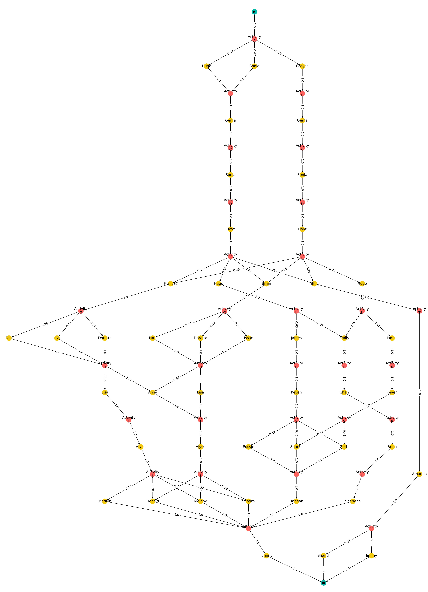

# Inferring A Multi-Perspective Likelihood Graph from Black-Box Next Event Predictors
This repository contains a prototype implementation of the method described in the paper *Inferring A Multi-Perspective Likelihood Graph from Black-Box Next Event Predictors*.
The method infers a directed and acyclic likelihood graph from a (deep learning) next event predictor to reveal and visualize what it has learned.

## Example Likelihood Graphs
The following likelihood graph was generated using our approach. 
Red nodes represent activities, yellow nodes the event attribute *user*. More examples can be found in `/examples`.

## Jupyter Lab Notebooks
Check the `notebooks` directory for example Jupyter Lab Notebooks. 
Follow the setup guide and make sure to install the *ipywidgets* extension (https://ipywidgets.readthedocs.io/en/latest/user_install.html) for Jupyter Lab.

## Setup
The easiest way to setup an environment is to use Miniconda.

### Using Miniconda
1. Install [Miniconda](https://conda.io/miniconda.html).
2. After setting up miniconda you can make use of the `conda` command in your command line (Powershell, CMD, Bash).
3. Set up a dedicated environment for this project by running `conda env create -f environment.yml`
    * This will setup a virtual conda environment with all necessary dependencies.
    * Installs the CPU only version of Tensorflow. 
4. Depending on your operating system you can activate the virtual environment with `conda activate neplg`.
6. If you want to quickly install the `neplg` package, run `pip install -e .` inside the root directory.
7. Now you can start the notebook server by `jupyter lab notebooks`.

Note: To use the graph plotting methods, you will have to install [Graphviz](https://graphviz.org/).

### IDE
We recommend you use [PyCharm](https://www.jetbrains.com/pycharm) Community Edition as your IDE.

## References
* [Nolle, T., Seeliger, A., Mühlhäuser, M.: BINet: Multivariate Business Process Anomaly Detection Using Deep Learning, 2018](https://doi.org/10.1007/978-3-319-98648-7_16)
* [Nolle, T., Luettgen, S., Seeliger, A., Mühlhäuser, M.: BINet: Multi-perspective Business Process Anomaly Classification, 2019](https://doi.org/10.1016/j.is.2019.101458)
